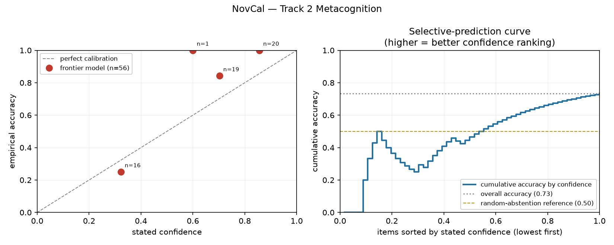

# NovCal

**A Procedurally-Generated Metacognition Benchmark**
程序化生成的元认知基准 · DeepMind/Kaggle *Measuring Progress Toward AGI* · **Track 2**

> 一个模型答对一道题，能证明的事情比人们以为的少得多。
> 它可能是在**回忆**，不是**推理**；可能**碰巧**，不是**知道**。
> **NovCal 问的是那个更基础的问题：它是否知道自己会答对？**

---

## 核心主张

现有元认知评估几乎全部构建在公开题库上（TriviaQA、CoQA、MMLU）。这带来一个方法论问题：

> 若题目存在于预训练数据中，"高置信度 + 正确"可能只反映**记忆**，而非**校准**。你无法区分"模型知道"和"模型背过"。

**NovCal 不发布题库，只发布生成器。** 每个"规则宇宙"在评测时由种子化 RNG 现场铸造——符号子集 C(46,4)≈16 万种，每个宇宙有独立的规则程序与守卫组合。**不同种子的任务空间可证明不相交**：不是"希望不重叠"，而是**保证不重叠**。

### 第二条主张：ECE 单独使用是一个陷阱

恒定输出 50% 置信度的系统，若准确率恰好 50%，其 **ECE = 0——完美校准**，却毫无元认知能力。

`scripts/demonstrate_ece_trap.py` 实证复现：

| 系统 | Accuracy | ECE↓ | AUROC↑ | 标记 |
|---|---|---|---|---|
| **陷阱系统**：恒定 50、准确率 50% | 0.500 | **0.000** | **0.500** | ⚠ 恒定输出 |
| 随机猜测 | 0.250 | 0.250 | 0.500 | ⚠ |
| **前沿模型（真实实测）** | **0.732** | 0.192 | **0.889** | — |
| 恒定 50、准确率 0%（实测基线） | 0.000 | 0.500 | n/a | ⚠ 地板 |

陷阱系统的 ECE（0.000）**优于**前沿模型（0.192），但 AUROC 仅 0.500——完全无信号。
**只按 ECE 排序的榜单会把它排在前沿模型之上。**

**因此 NovCal 强制并列报告 AUROC/AURC，并对四类退化系统自动打标；退化系统的 ECE 不得参与排名。** 这条规则已实现为代码断言，而非文档里的一句话。

```bash
python scripts/demonstrate_ece_trap.py   # 30 秒复现上述结论
```

---

## 快速开始 / Quick Start

**零第三方依赖**——仅需 Python 3.9+ 标准库。

```bash
git clone https://github.com/07Meteorain/AI.git
cd AI && python -m novcal.cli selftest        # 验证指标实现
python tests/test_novcal.py                   # 35 项测试
python -m novcal.cli run --solver heuristic --n-universes 40
python scripts/make_report.py                 # 生成对比表与校准图
```

### 接入真实模型

```bash
export OPENAI_API_KEY=sk-...
python scripts/run_model.py --provider openai --model gpt-4o --out results/gpt-4o.jsonl

# 本地 / 开源模型
python scripts/run_model.py --provider openai-compat \
    --model qwen2.5:7b --base-url http://localhost:11434/v1 --out results/qwen.jsonl
```

支持 `openai` / `anthropic` / `gemini` / `openai-compat`（vLLM、Ollama、DeepSeek、Qwen）。

---

## 任务形式

```
A hidden program transforms token sequences. You will observe worked
examples, then apply the SAME program to new inputs.

  example 1:
  input:  Ω △ △          output: △ △ Ω
  example 2:
  input:  ◆ Ω § ◆ ◆      output: ◆ ◆ § Ω ◆
  example 3:
  input:  Ω △ Ω ◆ ◆      output: ◆ ◆ Ω △ Ω

Input: Ω ◆ §
```

模型须严格按两行作答：

```
ANSWER: § ◆ Ω
CONFIDENCE: 88
```

提示词明确告知："**没有任何奖励对应高置信度，自信的错误会被重罚**"——若不说明惩罚结构，模型会学到"报高置信度是免费的"。

### 三阶段协议（KSTAR 对齐）

| 阶段 | 内容 | 测量对象 |
|---|---|---|
| A | 零知识基线 | 先验水平 |
| B | 3 示例后作答 | 归纳能力 + 校准 |
| **C** | **真实纠错反馈后**作答 | **ΔR→K 更新：从失败中修正** |

Phase C 的反馈是**真实的 (input → correct output) 对**，而非仅"错了"——携带信息的更新信号才构成真正的 ΔR。

---

## 指标面板 / Metrics

| 指标 | 方向 | 测什么 | 会被什么欺骗 |
|---|---|---|---|
| **ECE** | ↓ | 概率刻度的校准 | ⚠ 恒定输出 |
| **AUROC** | ↑ | 能否把对的排在错的前面 | 无（只认排序） |
| **AURC** | ↓ | 选择性预测质量 | 排序差的系统 |
| **Brier** | ↓ | 严格评分规则 | 两者都罚 |
| MCG | ↑ | 对时置信 − 错时置信 | — |
| slope/intercept | — | Cox 校准探针 | — |
| **退化检测** | — | 地板/天花板/恒定/低多样性/AUROC<0.6 | **强制标记** |

**硬性规则：退化系统的 ECE 不得参与排名。**

---

## 实测结果 / Results

| 系统 | n | Accuracy↑ | ECE↓ | AUROC↑ | AURC↓ |
|---|---|---|---|---|---|
| **前沿模型（合并）** | 56 | **0.732** | **0.192** | **0.889** | **0.072** |
| 启发式规则归纳 | 351 | 0.311 | 0.295 | 0.930 | 0.376 |
| 复制输入 | 351 | 0.000 | 0.450 | n/a | 1.000 |
| 恒定置信度 50 | 351 | 0.000 | 0.500 | n/a | 1.000 |
| 随机猜测 | 351 | 0.000 | 0.487 | n/a | 1.000 |
| Oracle（上界） | 351 | 1.000 | 0.000 | n/a | 0.000 |

**难度梯度单调陡峭**（启发式基线）：tier1 66.7% → tier2 25.6% → tier3 8.9% → tier4 0.0%



> ⚠️ **诚实声明：** 测试环境无任何 LLM API key，"前沿模型"是作者本人以 agent 身份作答——**这是真实运行，但存在自我偏好风险，且 n=56 样本偏小**。详见 `07Meteorain_C9_测试结果.md` §0。

---

## 项目结构

```
07Meteorain_C2A_C9_NovCal/
├── novcal/
│   ├── rules.py      程序化规则宇宙生成（反污染核心）
│   ├── metrics.py    ECE / AUROC / AURC / Brier / 退化检测
│   ├── harness.py    三阶段协议、KSTAR 反馈、评分
│   ├── models.py     模型适配层 + 离线参考求解器
│   └── cli.py        命令行 + selftest
├── tests/            35 项测试，含 4 条回归测试
├── scripts/
│   ├── run_model.py        接入任意 LLM
│   ├── score_frontier_run.py  评分 agent 作答记录
│   └── make_report.py      汇总对比表 + 校准图
├── results/          逐题原始记录（可独立复核）
└── docs/
```

---

## 文档 / Documents

| 文件 | 内容 |
|---|---|
| `07Meteorain_C2A_proposal.md` | 提案正文（四部分结构） |
| `07Meteorain_C9_task说明.md` | 任务说明 + 评分标准 |
| `07Meteorain_C9_测试结果.md` | 测试数据与分析 |
| `07Meteorain_C9_反思报告.md` | AAR 反思（含 3 个真实 bug） |
| `07Meteorain_C9_AI日志.md` | AI 使用记录与反向举证 |
| `07Meteorain_C9_拿来说明.md` | 借鉴来源与取舍分析 |
| `results/RESULTS.md` | 自动生成的对比表 |

---

## 设计中被测试抓到的三个真实 bug

诚实起见，记录开发过程中由自检/测试捕获的问题：

1. **`parse_sequence` 调用 `.lower()`** —— 破坏 Χ/Ψ/Σ 等大写希腊字母，**oracle 从 100% 掉到 40%**。只跑模型不跑上界自检，这个 bug 会完全隐藏。
2. **Phase B 提示词缺少 `Input:` 行** —— 模型收到示例却被问"输出什么"，Phase B 完全不可解。
3. **`x is not x` 检测 NaN 失效** —— CPython 缓存 NaN 单例，断言静默失效，出现"打印 nan 却 PASSED"的自相矛盾。

详见 `07Meteorain_C9_反思报告.md` §2。

---

## 局限 / Limitations

1. **尚无人类基线**——最重要的缺失，无法回答"AI 相对人类处于何处"
2. **无跨模型对比**——无 API key，仅一个模型且存在自我偏好风险
3. **样本量不足**——n=56，分层后更小，AUROC 波动大
4. **口头置信度 ≠ 内隐置信度**——只测自报，未测 token 概率
5. **符号序列 ≠ 真实世界任务**——外推需谨慎

---

## 致谢 / Attribution

站在以下工作肩上（完整取舍见 `07Meteorain_C9_拿来说明.md`）：
[ARC](https://arxiv.org/abs/1911.01547) (Chollet, 2019) ｜ [SCAN](https://arxiv.org/abs/1711.00350) (Lake & Baroni, 2018) ｜ [SelectiveNet](https://arxiv.org/abs/1901.09192) (Geifman & El-Yaniv, 2019) ｜ [Semantic Uncertainty](https://arxiv.org/abs/2302.09664) (Kuhn et al., 2023) ｜ [Guo et al. 2017](https://arxiv.org/abs/1706.04599) ｜ [DeepMind AGI 认知框架](https://storage.googleapis.com/deepmind-media/DeepMind.com/Blog/measuring-progress-toward-agi/measuring-progress-toward-agi-a-cognitive-framework.pdf)

另参考 Ding et al., *Calibration under Abstraction* (NeurIPS) 关于"ECE 与选择性预测是两种不同能力"的论述——**该文的具体 arXiv 编号未能核实，故此处不给出链接**（曾误写 `arXiv:2008.06000`，经查为无关的物理学论文，已删除）。

## 许可 / License

MIT